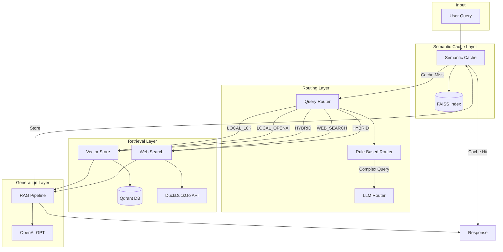
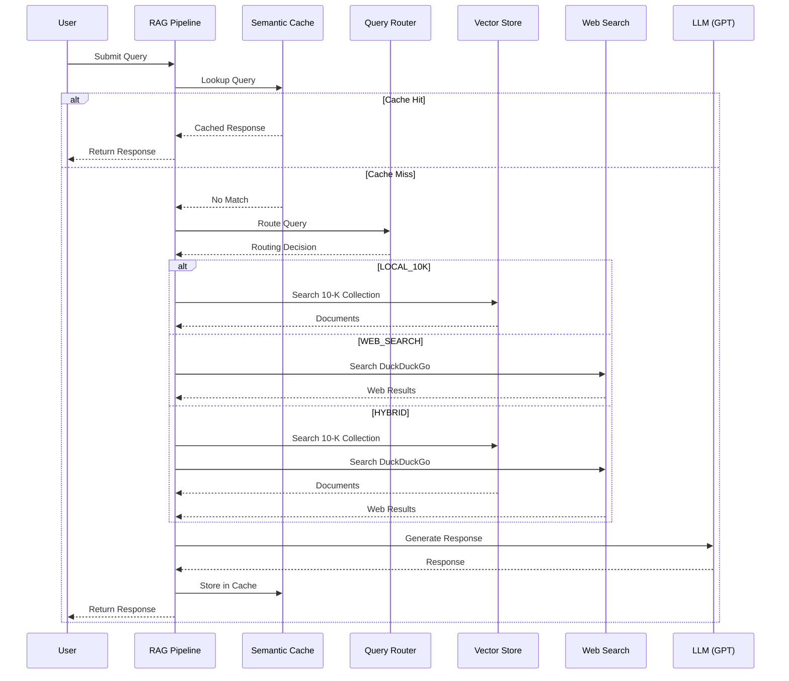
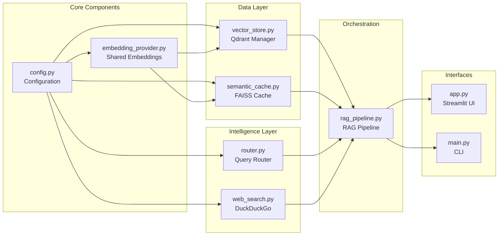
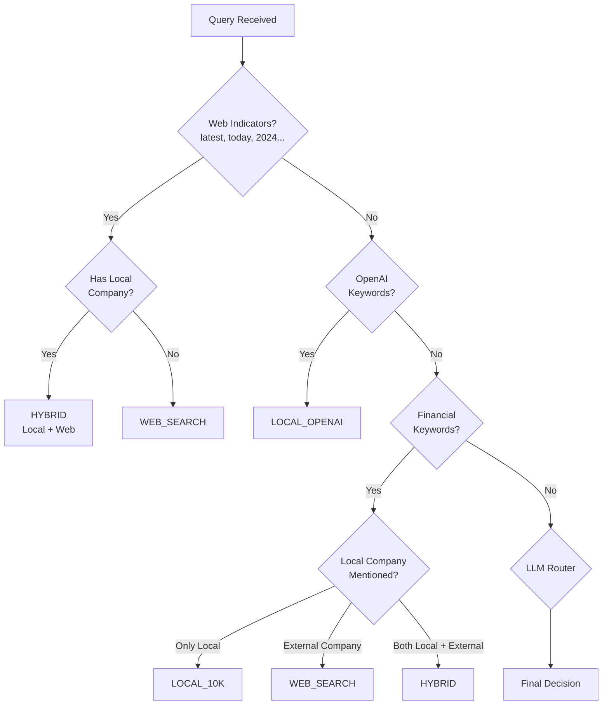
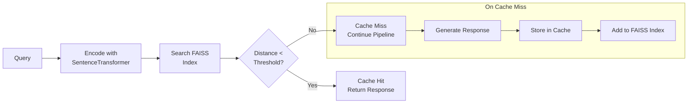

# Agentic Search Engine

A production-ready RAG (Retrieval-Augmented Generation) search engine with semantic caching, intelligent query routing, and web search capabilities.

## Features

- **Semantic Caching**: FAISS-based cache that retrieves responses for semantically similar queries, dramatically reducing latency and API costs
- **Intelligent Query Routing**: Automatically routes queries to the appropriate data source (local 10-K filings, OpenAI docs, or web search)
- **Hybrid Search**: Combines local vector search with live web search for comprehensive answers
- **10-K Financial Data**: Pre-indexed SEC 10-K filings for financial analysis queries
- **Web Search Fallback**: DuckDuckGo integration for current events and external company data
- **Multiple Frontends**:
  - **Next.js Web Client**: Modern React-based UI with Tailwind CSS and shadcn/ui components
  - **Streamlit Web UI**: Interactive Python frontend with search history, cache statistics, and debug mode
- **FastAPI REST API**: Full-featured API server with endpoints for search, embeddings, ingestion, and cache management
- **CLI Interface**: Full-featured command-line interface for scripting and automation
- **Redis Support**: Optional Redis-backed semantic cache for distributed deployments

## Architecture

### High-Level Overview



### Query Processing Flow



### Component Architecture



### Query Router Decision Flow



## Installation

### Prerequisites

- Python 3.11+
- OpenAI API key

### Setup

1. **Clone and navigate to directory**:
   ```bash
   cd agenticSearchEngine
   ```

2. **Create virtual environment**:
   ```bash
   python -m venv venv
   source venv/bin/activate  # On Windows: venv\Scripts\activate
   ```

3. **Install dependencies**:
   ```bash
   pip install -r requirements.txt
   ```

4. **Configure environment**:
   ```bash
   # Create .env file
   echo "OPENAI_API_KEY=your-api-key-here" > .env
   ```

5. **Verify Qdrant data**:
   Ensure `qdrant_data/` directory contains the pre-indexed 10-K vectors.

## Usage

### FastAPI Server + Next.js Client (Recommended)

**1. Start the FastAPI backend:**

```bash
# With environment variables for Apple Silicon
PYTORCH_ENABLE_MPS_FALLBACK=1 TOKENIZERS_PARALLELISM=false uvicorn api:app --reload --port 8000
```

Opens at `http://localhost:8000` with:
- `POST /search` - RAG search endpoint
- `POST /embed` - Single text embedding
- `POST /embed/batch` - Batch embeddings
- `POST /ingest/text` - Chunk and embed text
- `POST /ingest/pdf` - Extract and embed PDF
- `POST /ingest/qdrant` - Store in Qdrant
- `GET /cache/stats` - Cache statistics
- `POST /cache/clear` - Clear cache
- `GET /health` - Health check

**2. Start the Next.js frontend:**

```bash
cd web-client
npm install
npm run dev
```

Opens at `http://localhost:3000` with:
- Modern search interface
- Real-time cache statistics
- Search history
- Source document viewer

### Streamlit Interface

```bash
streamlit run app.py
```

Opens at `http://localhost:8501` with:
- Search input with example queries
- Web search toggle
- Cache statistics dashboard
- Debug mode for routing/timing details
- Search history

### Command Line Interface

```bash
# Single query
python main.py "What are Lyft's main risk factors?"

# Interactive mode
python main.py -i

# With web search enabled
python main.py -w "Latest Nvidia earnings"

# Verbose output with timing
python main.py -v "What is the revenue breakdown?"

# JSON output
python main.py --json "Company financials"

# Cache management
python main.py --stats          # View cache statistics
python main.py --clear-cache    # Clear the cache
python main.py --collections    # List available collections
```

### CLI Options

| Flag | Description |
|------|-------------|
| `-i, --interactive` | Interactive mode |
| `-w, --web` | Enable web search |
| `--no-web` | Disable web search |
| `-k, --top-k N` | Number of documents to retrieve |
| `--no-cache` | Disable semantic cache |
| `-v, --verbose` | Show routing and timing details |
| `--json` | Output as JSON |
| `--stats` | Show cache statistics |
| `--clear-cache` | Clear the cache |
| `--collections` | List vector collections |

### Python API

```python
from rag_pipeline import RAGPipeline

# Initialize pipeline
pipeline = RAGPipeline(
    enable_cache=True,
    enable_web_search=True,
)

# Search
result = pipeline.search(
    query="What are the main risk factors in the 10-K filings?",
    allow_web_search=False,  # Override for this query
    top_k=5,
)

# Access results
print(result.response)
print(f"Cache hit: {result.cache_hit}")
print(f"Sources: {len(result.sources)}")
print(f"Timing: {result.timing}")
```

## Configuration

Environment variables (via `.env` file):

| Variable | Default | Description |
|----------|---------|-------------|
| `OPENAI_API_KEY` | (required) | OpenAI API key |
| `OPENAI_MODEL` | `gpt-4o-mini` | Model for routing |
| `OPENAI_RAG_MODEL` | `gpt-4o-mini` | Model for RAG generation |
| `QDRANT_PATH` | `./qdrant_data` | Path to Qdrant vectors |
| `EMBEDDING_MODEL` | `nomic-ai/nomic-embed-text-v1.5` | Sentence transformer model |
| `TOP_K_RESULTS` | `5` | Default documents to retrieve |
| `CACHE_SIMILARITY_THRESHOLD` | `0.78` | Semantic cache threshold |
| `CACHE_MAX_SIZE` | `10000` | Maximum cache entries |
| `WEB_SEARCH_TIMEOUT` | `10` | Web search timeout (seconds) |
| `ENABLE_WEB_SEARCH` | `true` | Enable web search by default |
| `LOG_LEVEL` | `INFO` | Logging level |

## Project Structure

```
agentic-search-engine/
├── app.py                      # Streamlit entry point
├── main.py                     # CLI entry point
├── api.py                      # FastAPI server (REST API)
├── requirements.txt            # Python dependencies
├── pyproject.toml              # Python project config
├── .env.example                # Environment template
├── .gitignore                  # Git ignore rules
│
├── src/                        # Python source code
│   └── agentic_search/         # Main package
│       ├── __init__.py
│       ├── cache/              # Semantic caching
│       │   ├── semantic_cache.py      # FAISS + JSON cache
│       │   └── redis_cache.py         # Redis-backed cache
│       ├── config/             # Configuration
│       │   ├── settings.py            # Environment settings
│       │   └── factory.py             # Pipeline factory
│       ├── core/               # Core models
│       │   ├── models.py              # Data models (SearchResult, etc.)
│       │   └── base.py                # Base interfaces
│       ├── embeddings/         # Embedding models
│       │   └── sentence_transformer.py
│       ├── llm/                # LLM providers
│       │   └── openai_llm.py          # OpenAI GPT integration
│       ├── pipeline/           # RAG orchestration
│       │   └── rag_pipeline.py        # Main pipeline
│       ├── retrievers/         # Document retrieval
│       │   ├── qdrant_retriever.py    # Vector store retrieval
│       │   └── web_search.py          # DuckDuckGo search
│       ├── routers/            # Query routing
│       │   ├── rule_based.py          # Keyword-based routing
│       │   ├── llm_router.py          # LLM-based routing
│       │   └── composite.py           # Combined router
│       └── ui/                 # User interfaces
│           ├── streamlit_app.py       # Streamlit UI
│           └── cli.py                 # CLI interface
│
├── web-client/                 # Next.js frontend
│   ├── src/
│   │   ├── app/                # Next.js App Router
│   │   │   ├── page.tsx               # Main search page
│   │   │   ├── layout.tsx             # Root layout
│   │   │   └── globals.css            # Global styles
│   │   ├── components/         # React components
│   │   │   └── ui/                    # shadcn/ui components
│   │   └── lib/                # Utilities
│   │       └── utils.ts               # Helper functions
│   ├── package.json            # Node dependencies
│   ├── tailwind.config.ts      # Tailwind CSS config
│   └── tsconfig.json           # TypeScript config
│
├── docs/                       # Documentation
│   └── workflow-diagram.md     # Mermaid architecture diagrams
│
├── qdrant_data/                # Pre-indexed vector data
│   └── collection/
│       ├── 10k_data/           # 10-K financial filings
│       └── opnai_data/         # OpenAI documentation
│
└── examples/                   # Example scripts
```

## Key Components

### Query Router (`router.py`)

Determines the optimal data source for each query:

| Intent | Data Source | Example Queries |
|--------|-------------|-----------------|
| `LOCAL_10K` | Qdrant 10-K collection | "Lyft revenue", "risk factors" |
| `LOCAL_OPENAI` | Qdrant OpenAI docs | "GPT API", "embeddings" |
| `WEB_SEARCH` | DuckDuckGo | "Latest news", "Apple earnings" |
| `HYBRID` | Both local + web | "Compare Lyft to Uber" |

Uses rule-based routing for common patterns and falls back to LLM routing for ambiguous queries.

### Semantic Cache (`semantic_cache.py`)



Features:
- Encodes queries using sentence transformers (nomic-embed-text-v1.5)
- FAISS IndexFlatL2 for similarity search
- Configurable similarity threshold (default 0.78)
- Automatic eviction when cache is full (removes oldest 10%)
- Persistent JSON storage

### Vector Store (`vector_store.py`)

Qdrant-based document retrieval:
- Pre-indexed 10-K financial filings
- OpenAI documentation
- Efficient similarity search with score ranking
- Shared embedding model to save memory

### Web Search (`web_search.py`)

DuckDuckGo integration with:
- Automatic news vs text search detection
- Configurable timeout (10s default) for graceful degradation
- Result formatting for RAG context

## Performance Optimizations

1. **Shared Embedding Model**: Single `SentenceTransformer` instance shared across `SemanticCache` and `VectorStore` (saves ~1GB RAM)
2. **Semantic Caching**: ~70% cache hit rate reduces API calls significantly
3. **Lazy Loading**: Components initialized on-demand
4. **Graceful Degradation**: Timeouts and error handling prevent pipeline hangs
5. **Cache Size Limits**: Automatic LRU-style eviction prevents unbounded memory growth
6. **Proper Logging**: Configurable log levels, no print() statements

## Example Queries

**Financial Analysis**:
- "What are the main risk factors mentioned in Lyft's 10-K?"
- "What is Lyft's revenue breakdown by segment?"
- "How has Lyft's operating income changed?"

**Hybrid Queries**:
- "Compare Lyft and Uber earnings in 2023"
- "Lyft revenue versus Apple revenue"

**Current Events** (Web Search):
- "Latest Nvidia earnings report"
- "Top movies at box office this week"
- "Recent Tesla stock news"

## API Costs

| Operation | Cost |
|-----------|------|
| Query Routing | ~$0.001 (GPT-4o-mini) |
| RAG Generation | ~$0.002-0.005 (GPT-4o-mini) |
| Embeddings | Free (local Sentence Transformers) |
| Web Search | Free (DuckDuckGo) |
| Cache Hit | Free (local lookup) |

**Estimated**: ~$0.003-0.006 per query (cache miss), $0 for cache hits

## Troubleshooting

### "Vector store not found"
Ensure `qdrant_data/` directory exists with pre-indexed vectors.

### "OPENAI_API_KEY is required"
Set the API key in `.env` file or environment variable.

### Slow startup
First run downloads the embedding model (~500MB). Subsequent runs use cached model.

### Web search not working
Check internet connection and ensure `ENABLE_WEB_SEARCH=true`.

### High memory usage
The embedding model requires ~1GB RAM. This is shared across components via `EmbeddingProvider` singleton.

## Hardware Requirements

| Component | Minimum | Recommended |
|-----------|---------|-------------|
| RAM | 8GB | 16GB |
| Storage | 2GB | 5GB |
| GPU | Not required | Optional (faster embeddings) |
| Network | Required | Required |

## License

MIT License
