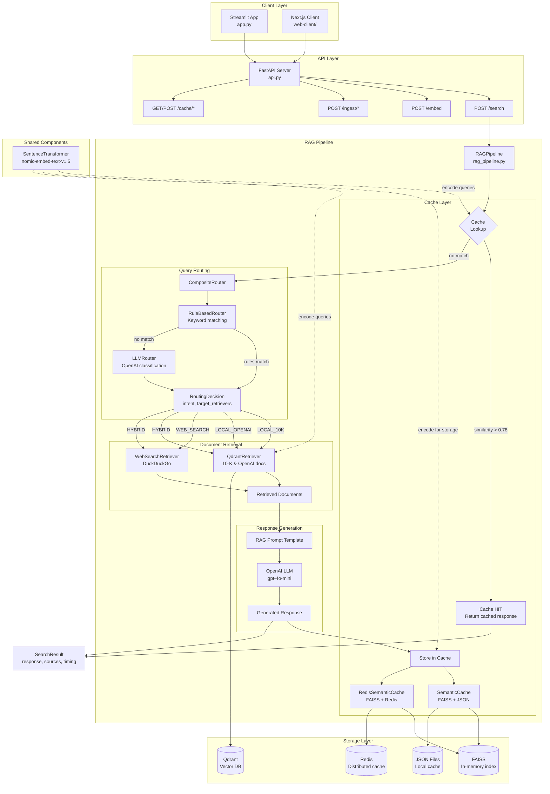
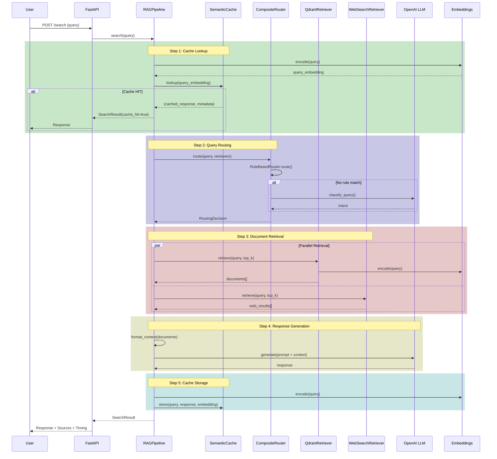
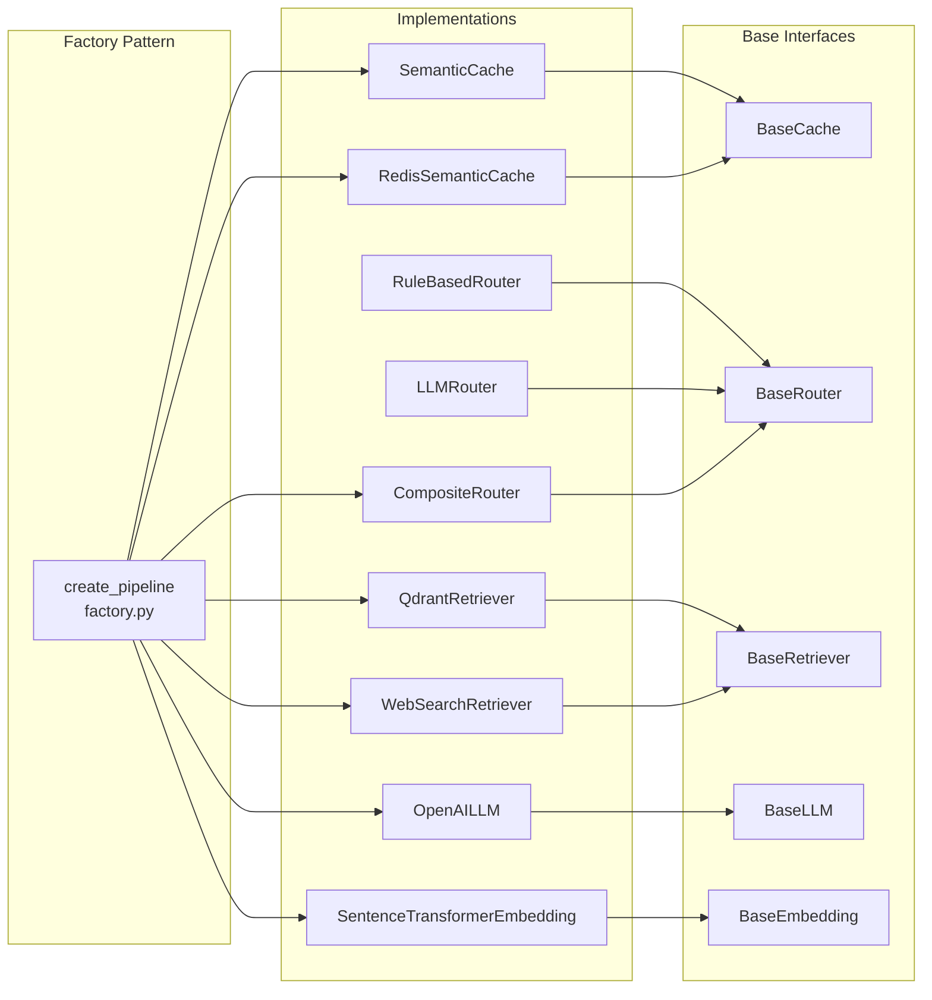

# Agentic Search Engine - Workflow Diagram

## System Architecture

---

## Sequence Diagram (Request Flow)

---

## Component Diagram (Interfaces & Implementations)

---

## Data Flow Summary

| Step | Component | Input | Output | Timing |
|------|-----------|-------|--------|--------|
| 1 | Cache Lookup | query | cached_response OR miss | ~5ms |
| 2 | Query Routing | query | RoutingDecision (intent, retrievers) | 10-500ms |
| 3 | Document Retrieval | query, top_k | List[Document] | 100-2000ms |
| 4 | LLM Generation | context, query | response text | 500-3000ms |
| 5 | Cache Storage | query, response | stored entry | ~20ms |
| **Total** | | | SearchResult | **615-5525ms** |

---

## Key Components

### RAGPipeline (`rag_pipeline.py`)
- Orchestrates the complete search flow
- Dependency injection for all components
- Handles timing and error recovery

### SemanticCache (`semantic_cache.py`)
- FAISS index for similarity search
- Cosine similarity threshold: 0.78
- LRU eviction when max_size reached

### CompositeRouter (`router.py`)
- Tries RuleBasedRouter first (fast keyword matching)
- Falls back to LLMRouter (OpenAI classification)
- Returns: LOCAL_10K, LOCAL_OPENAI, WEB_SEARCH, or HYBRID

### Retrievers
- **QdrantRetriever**: Vector similarity search on local documents
- **WebSearchRetriever**: DuckDuckGo search for current information

### OpenAILLM (`openai_llm.py`)
- Model: gpt-4o-mini
- Temperature: 0.3
- RAG prompt template for context-aware generation

---

## Query Intent Types

| Intent | Description | Retrievers Used |
|--------|-------------|-----------------|
| `LOCAL_10K` | Financial 10-K filing questions | qdrant_10k_data |
| `LOCAL_OPENAI` | OpenAI documentation questions | qdrant_opnai_data |
| `WEB_SEARCH` | Current events, news, general web | web_search |
| `HYBRID` | Complex queries needing multiple sources | qdrant + web_search |

---

## Storage Systems

| System | Purpose | Persistence | Use Case |
|--------|---------|-------------|----------|
| **Qdrant** | Document vectors | Disk | 10-K filings, OpenAI docs |
| **FAISS** | Cache query index | Memory | Fast similarity lookup |
| **Redis** | Distributed cache | Disk + Memory | Scalable caching |
| **JSON** | Local cache backup | Disk | Single-instance caching |
